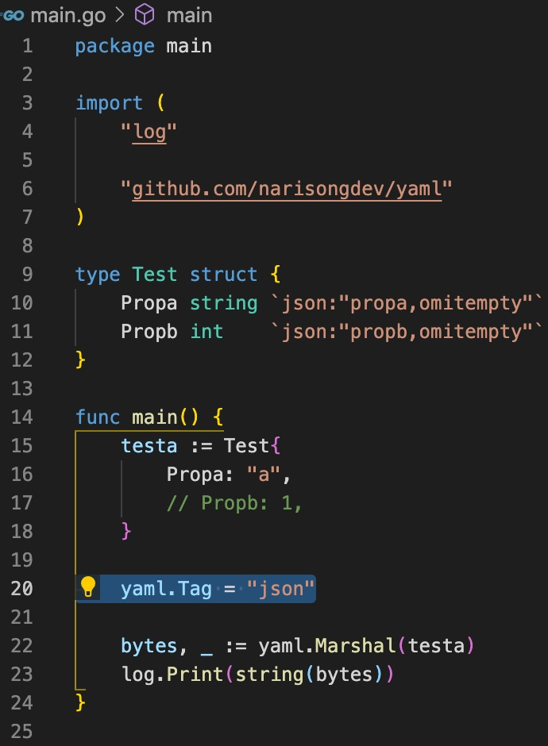
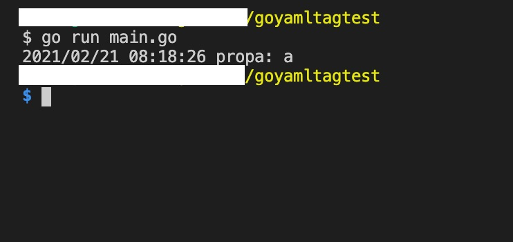

# YAML support for the Go language

Note
------------
The original go-yaml package does not support "json" or any struct tag except "yaml" as of 1/11/2021. This fork adds that support by simply exposing `yaml.Tag`. The default is "yaml". By overriding it with "json", the json tags will be used.



The output



Introduction
------------

The yaml package enables Go programs to comfortably encode and decode YAML
values. It was developed within [Canonical](https://www.canonical.com) as
part of the [juju](https://juju.ubuntu.com) project, and is based on a
pure Go port of the well-known [libyaml](http://pyyaml.org/wiki/LibYAML)
C library to parse and generate YAML data quickly and reliably.

Compatibility
-------------

The yaml package supports most of YAML 1.2, but preserves some behavior
from 1.1 for backwards compatibility.

Specifically, as of v3 of the yaml package:

 - YAML 1.1 bools (_yes/no, on/off_) are supported as long as they are being
   decoded into a typed bool value. Otherwise they behave as a string. Booleans
   in YAML 1.2 are _true/false_ only.
 - Octals encode and decode as _0777_ per YAML 1.1, rather than _0o777_
   as specified in YAML 1.2, because most parsers still use the old format.
   Octals in the  _0o777_ format are supported though, so new files work.
 - Does not support base-60 floats. These are gone from YAML 1.2, and were
   actually never supported by this package as it's clearly a poor choice.

and offers backwards
compatibility with YAML 1.1 in some cases.
1.2, including support for
anchors, tags, map merging, etc. Multi-document unmarshalling is not yet
implemented, and base-60 floats from YAML 1.1 are purposefully not
supported since they're a poor design and are gone in YAML 1.2.

Installation and usage
----------------------

The import path for the package is *github.com/narisongdev/yaml*.

To install it, run:

    go get github.com/narisongdev/yaml

API documentation
-----------------

If opened in a browser, the import path itself leads to the API documentation:

  - [https://github.com/narisongdev/yaml](https://github.com/narisongdev/yaml)

API stability
-------------

The package API for yaml v3 will remain stable as described in [gopkg.in](https://gopkg.in).


License
-------

The yaml package is licensed under the MIT and Apache License 2.0 licenses.
Please see the LICENSE file for details.


Example
-------

```Go
package main

import (
        "fmt"
        "log"

        "github.com/narisongdev/yaml"
)

var data = `
a: Easy!
b:
  c: 2
  d: [3, 4]
`

// Note: struct fields must be public in order for unmarshal to
// correctly populate the data.
type T struct {
        A string
        B struct {
                RenamedC int   `yaml:"c"`
                D        []int `yaml:",flow"`
        }
}

func main() {
        t := T{}
    
        err := yaml.Unmarshal([]byte(data), &t)
        if err != nil {
                log.Fatalf("error: %v", err)
        }
        fmt.Printf("--- t:\n%v\n\n", t)
    
        d, err := yaml.Marshal(&t)
        if err != nil {
                log.Fatalf("error: %v", err)
        }
        fmt.Printf("--- t dump:\n%s\n\n", string(d))
    
        m := make(map[interface{}]interface{})
    
        err = yaml.Unmarshal([]byte(data), &m)
        if err != nil {
                log.Fatalf("error: %v", err)
        }
        fmt.Printf("--- m:\n%v\n\n", m)
    
        d, err = yaml.Marshal(&m)
        if err != nil {
                log.Fatalf("error: %v", err)
        }
        fmt.Printf("--- m dump:\n%s\n\n", string(d))
}
```

This example will generate the following output:

```
--- t:
{Easy! {2 [3 4]}}

--- t dump:
a: Easy!
b:
  c: 2
  d: [3, 4]


--- m:
map[a:Easy! b:map[c:2 d:[3 4]]]

--- m dump:
a: Easy!
b:
  c: 2
  d:
  - 3
  - 4
```

